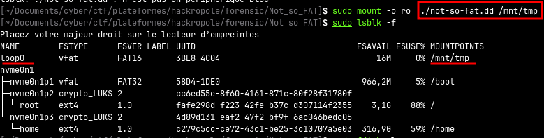
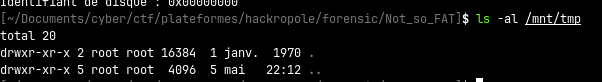
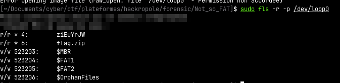
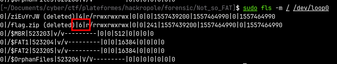
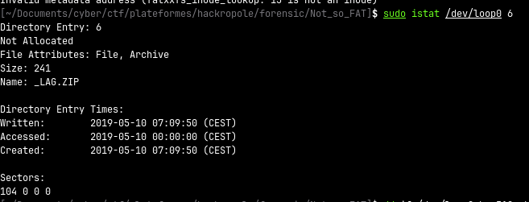
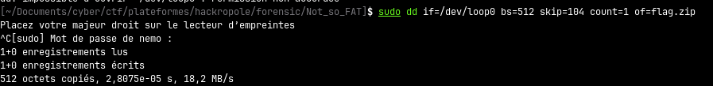
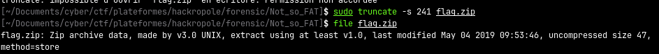
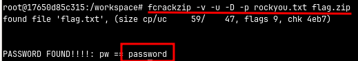

# Not so FAT

## Description

> J’ai effacé mon flag par erreur, pourriez-vous le retrouver pour moi ?

## Challenge

### Analyse

Récupération du fichier `not-so-fat.dd` que nous allons analyser rapidement pour comprendre ce que c'est, même si l'extension nous indique qu'il s'agit d'une image disque.

| commande | Sortie | Analyse |
|:-------- |:--------:| --------:|
|`file not-so-fat.dd`| `not-so-fat.dd: DOS/MBR boot sector, code offset 0x3c+2, OEM-ID "mkfs.fat", sectors/cluster 4, reserved sectors 4, root entries 512, sectors 32768 (volumes <=32 MB), Media descriptor 0xf8, sectors/FAT 32, sectors/track 32, heads 64, serial number 0x3be84c04, unlabeled, FAT (16 bit)` | Le fichier semble être un disque, le formatage aurait été fait sous Linux `mkfs.fat` et avec un filesystem FAT16|
|`fsstat not-so-fat.dd`| `File System Type: FAT16 OEM Name: mkfs.fat` | confirme le type de FS |

On monte l'image disque et on voit que le disque ne contient pas de fichier :

Le bloc disque est monté sur /dev/loop, on peut regarder rapidement avec `fls` de la suite sleuth kit s'il contient des fichiers supprimés :

Le résultat révèle plusieurs entrées identifiées comme des fichiers supprimés, ce qui signifie qu'ils faisaient autrefois partie du système de fichiers mais qu'ils ont été unlinked.

à récupérer : `flag.zip`

### Récupération

*Pour récupérer les fichiers supprimés on pourrait utiliser photorec mais c'est pas marrant.*

---

On commence par récupérer l'inode du fichier supprimé `flag.zip` puis les informations de l'inode pour voir à partir de quel secteurs il faut dumper :

Le secteur de départ est 104 et le fichier fait 241 octets.

Maintenant on peut utiliser `dd` pour dumper le secteur 104 puis tronquer le fichier à 241 octets (car un secteur = 512 octets donc pas besoin du reste):

Le fichier est chiffré avec un mot de passe qu'on casse avec fcrackzip :

**FLAG** : `ECSC{eefea8cda693390c7ce0f6da6e388089dd615379}` 