# iForensic

## Description

Lors d’un passage de douane, le douanier vous demande de lui remettre votre téléphone ainsi que son code de déverrouillage. Le téléphone vous est rendu quelques heures plus tard …

Suspicieux, vous envoyez votre téléphone pour analyse au CERT-FR de l’ANSSI. Les analystes du CERT-FR effectuent une collecte sur le téléphone, composée d’un sysdiagnose et d’un backup.

---

## Contexte

### Sysdiagnose

Un sysdiagnose est une capture diagnostique complète de l'état du système iOS à un instant T. Il contient : logs système, état des processus, info réseau, données de crash, métriques matérielles, etc.

Le sysdiagnose lui-même est un seul fichier archive :
  `DiagnosticLogs\sysdiagnose\sysdiagnose_2025.04.07_08-06-18-0700_iPhone-OS_iPhone_20A362.tar.gz`

 Les autres fichiers présents dans le dossier CrashReporter ont été collectés en même temps lors du déclenchement du sysdiagnose :
  - CoreCapture\WiFi\ — capture état WiFi
  - Baseband\ — traces modem cellulaire (.istp)
  - Cloud\ — logs CloudDocs/iCloud
  - FilesystemMeta-*.fsmeta.tgz — métadonnées du système de fichiers
  - powerlog_*.PLSQL — consommation énergie
  - awdd-*.metriclog — métriques analytiques Apple

### Crashes

Les fichiers `.ips` sont les rapports de crash. Voici la liste :
- mussel
- Signal
- SiriSearchFeedback
- stacks
- WiFi metrics

Les crashes dans `Retired` (plus anciens/archivés) : WiFiLQMMetrics, aggregated, siriactionsd, amsengagementd, UserEventAgent

### Backup

#### Type de backup

Afin de déterminer le type de sauvegarde, les informations nécessaires sont extraites du fichier Backup/info.plist :

```xml
<key>iTunes Version</key>
<string>12.10.5</string>
```

Ces éléments semblent indiquer qu'il s'agit d'une sauvegarde iTunes. Cette hypothèse est confirmée par cette source, qui renseigne également sur l'architecture des backup itunes : https://gist.github.com/leminlimez/c602c067349140fe979410ef69d39c28

> Backups are structured as a folder containing 4 main files and the contents of the files being restored. The main files are Info.plist, Manifest.mbdb, Manifest.plist, and Status.plist. The file contents have no extension and are titled by the SHA1 hashes of the file.

#### Backup chiffrée ?

Le mot de passe demandé lors de l'ouverture de la sauvegarde avec iLEAPP nous indique que la sauvegarde aurait été **chiffrée**.

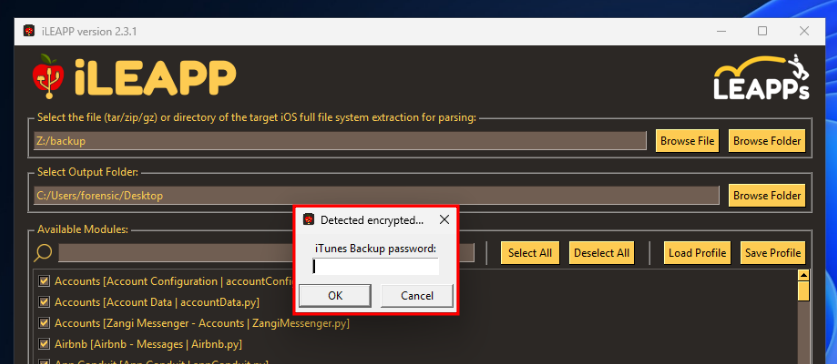

En vérifiant davantage,la backup a bien été chiffrée puisqu'elle présente ces valeurs dans `Manifest.plist`:
- `IsEncrypted: true`
- Présence d'un `BackupKeyBag` avec le matériel crypto requis pour le chiffrement
- Présence d'une `ManifestKey`

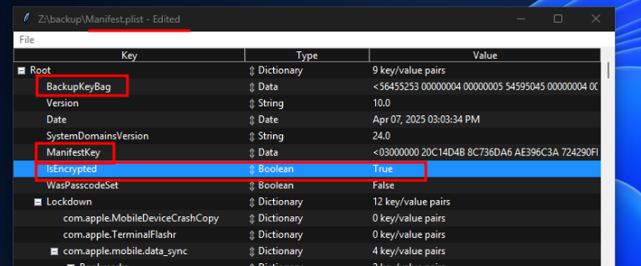

#### Mais Backup déchiffrée finalement...

Seulement il est possible de lire le contenu de `Manifest.db` et cela semble pareil pour les autres fichiers de la backup. Celle-ci a donc été déchiffrée par un script ou outil qui ne reconstitue pas l'arborescence, avant de nous la transmettre. Aucun problème donc la backup **n'est plus chiffrée**.

> Un petit trick consiste à modifier `"IsEncrypted": true` à `false` dans le Manifest.plist et iLEAPP arrive à ouvrir la backup.

> **Aparté :** Pendant mes recherches j'ai créer un script qui permet de récupérer un hash format hashcat pour casser le password d'une backup itunes chiffrée : [itunesbackup2hashcat](https://github.com/0xNemo/itunesbackup2hashcat) 

---

## Challenge

### iCrash

**Flag :** fcsc_intro.txt : `FCSC{7a1ca2d4f17d4e1aa8936f2e906f0be8}`

### iDevice
>Pour commencer, trouvez quelques informations d’intérêt sur le téléphone : version d’iOS et identifiant du modèle de téléphone. Le flag est au format FCSC{<identifiant du modèle>|<numéro de build>}. Par exemple, pour un iPhone 14 Pro Max en iOS 18.4 (22E240) : FCSC{iPhone15,3|22E240}.

La plupart des crash dump, quelques fichiers du sysdiagnose ainsi que les `.plist` à la racine de de la backup comme `Info.plist`, nous donne les informations demandées : `iPhone12,3 & 20A362`

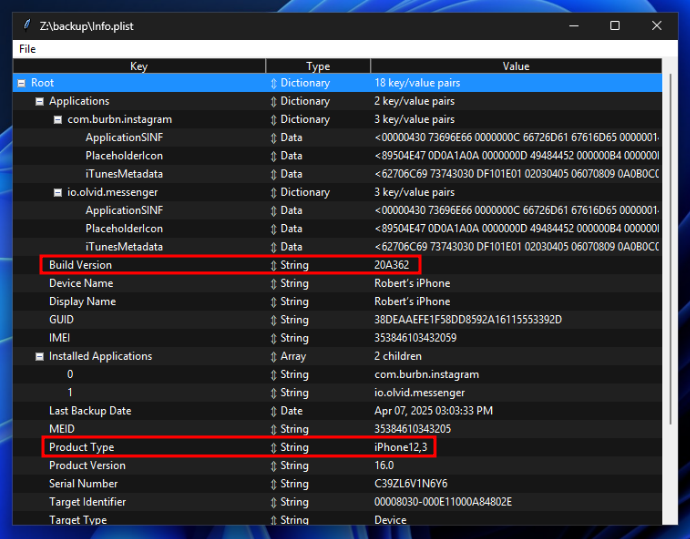

**Flag :** `FCSC{iPhone12,3|20A362}`

### iWifi

iLEAPP est un outil d'investigation iOS qui permet de parser des FS / FFS / backup iOS. Il est capable de parser les sysdiagnose directement et nous donne le SSID + BSSID du wifi sur lequel le téléphone était connecté.

Sinon on regade à la main dans le sysdiagnose le dossier wifi dans lequel on trouve com.apple.wifi.known-networks.plist. Celui-ci contient les informations de connexions récentes à un wifi : On obtient `BSSID : 66:20:95:6c:9b:37` et `SSID : 46435343` qui donne `FCSC` en hexadécimal.

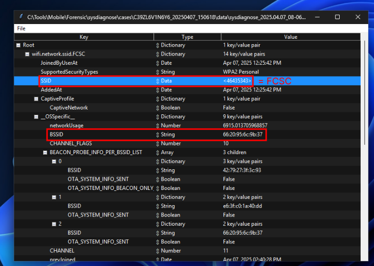

Le fichier Manifest.db est une base de données sqlite présente à la racine des backup itunes qui donne l'arborescence des fichiers au moment de la backup. Elle fait le lien entre :

- le chemin relatif du fichier/dossier sur le téléphone
- et le nom du fichier/dossier dans la backup qui sont des hash sha1 

En filtrant les chemins sur `account` on tombe sur le fichier Library/Accounts/VerifiedBackup/Accounts3.sqlite qui semble intéressant pour trouver des informations sur le compte. Il est lié au fichier `5852108669e3d13ab0f42ccbea424b6a55aee97b` qu'on ouvre avec db browser -> `robertswigert@icloud.com`

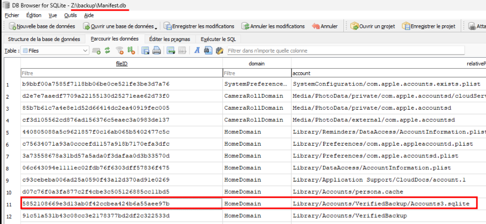
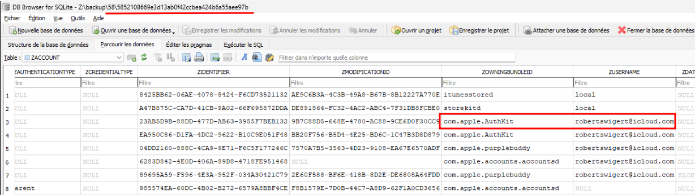

**Flag :** `FCSC{FCSC|66:20:95:6c:9b:37|robertswigert@icloud.com}`

### iTreasure

Avec iLEAPP on voit qu'une conversation SMS existe. Il s'envoie des messages dont une image qui n'est pas affichée par l'outil.

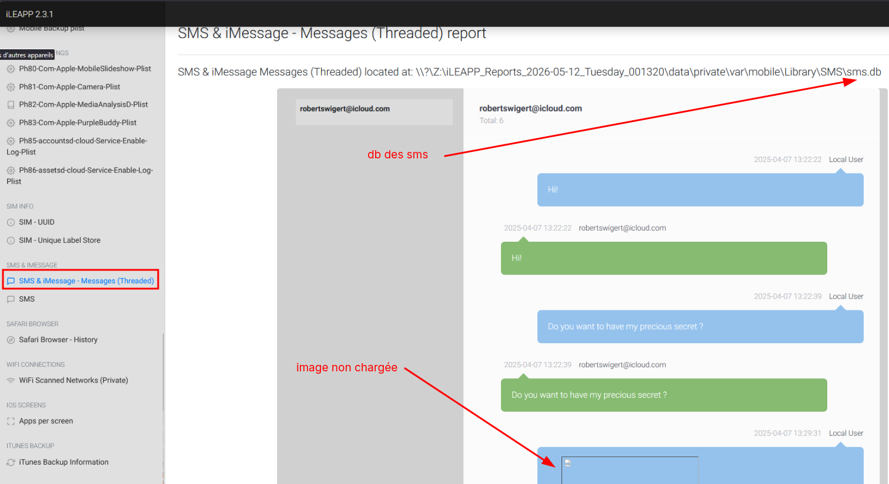

On récupère la base de données `sms.db` qui contient toutes les informations des conversations SMS. Dans la table `attachment` on récupère le nom du fichier  `679329D1-12E7-45F2-A082-1E58A6CB454F.HEIC`, on recroise avec le nom sha1 du fichier dans la backup -> `6f4e34098e00a80fde876c8638fb1d685be2318b` qu'on ouvre avec un éditeur d'image.

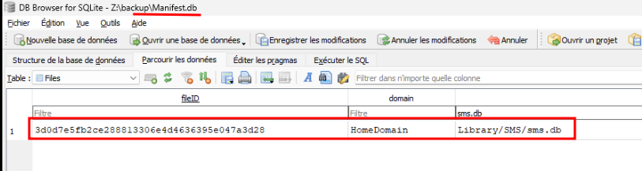
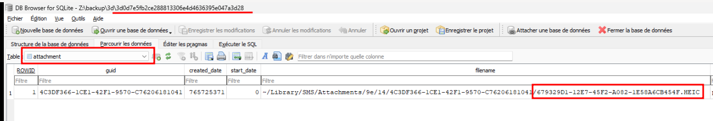
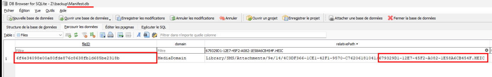

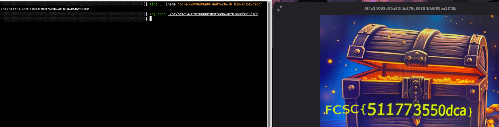

**Flag :** `FCSC{511773550dca}`

### iNvisible

On suppose que des parsers comme iLEAPP ne prennent pas la peine d'afficher des sms qui ne s'envoie pas. 

On va directement chercher `sms.db` mapper à `3d0d7e5fb2ce288813306e4d4636395e047a3d28`. Et dans le table `chat` on trouve un nouveau destinataire pour lequel il n'y a pas de message envoyés :

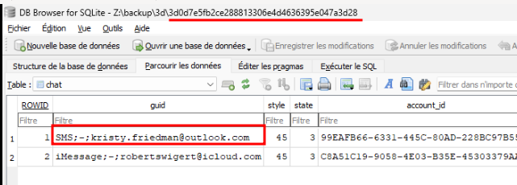

**Flag :** `FCSC{kristy.friedman@outlook.com}`

### Backdoor 1 & 2

Lorsqu'on regarde dans les applications installées par date, 3 se distinguent : Signal, Olvid et Instagram. Une seule des trois applications a déjà été désinstallée, c'est Signal à la date `2025-04-07 07:40:47`. En plus de ça, il semblerait que ce soit la seul application pour laquelle il y a des crash.
On a aussi un outil trolldecrypt qui a été installé qui peut déchiffrer des application et qui permettrait de patcher une application existante.

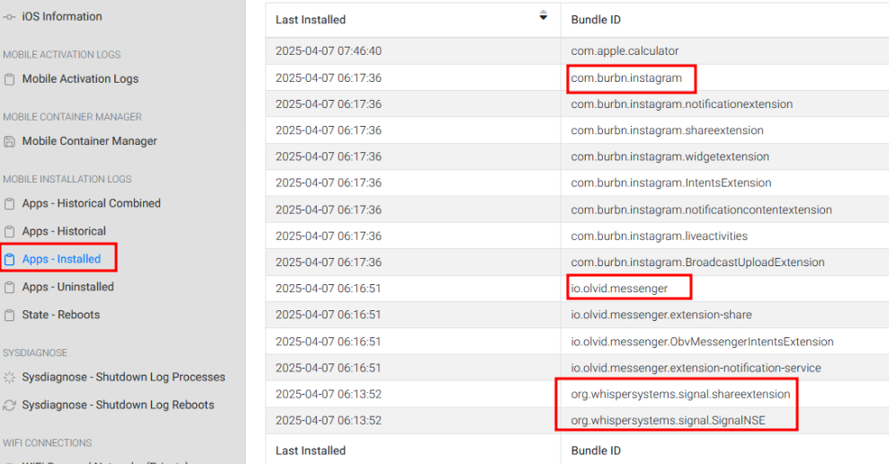
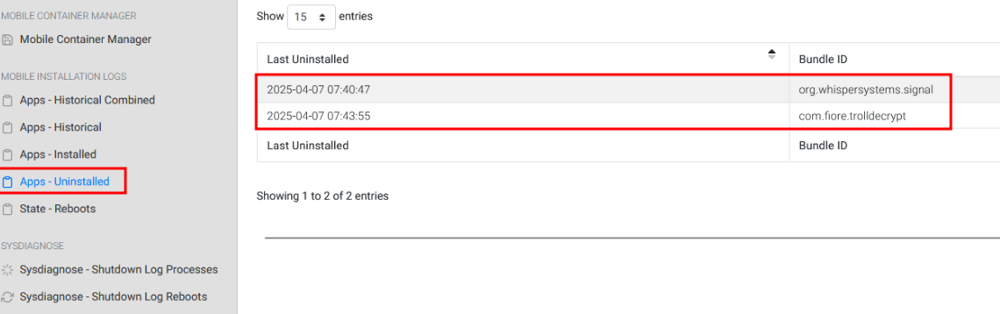

Si on creuse autour de Signal (identifiant : org.whispersystems.signal) on ressort un binaire "mussel" qui apparait dans la liste des processus en cours du sysdiagnose et dans les crash ips. Une chaine base 64 est passée en paramètre du processus : `dGNwOi8vOTguNjYuMTU0LjIzNToyOTU1Mg==` qui donne -> `tcp://98.66.154.235:29552`

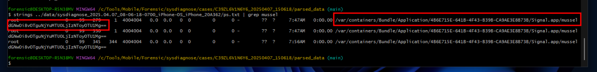
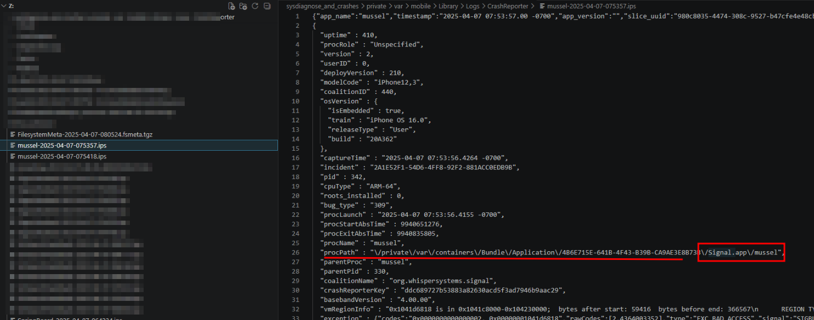

Mussel est l'implant du framework de post-exploitation **SeaShell** (aussi appelé **pwny**). Il est embarqué dans le bundle de Signal et établit un tunnel TCP vers le serveur C2.

dans la liste des processus on trouve le process Signal.app/Signal : `mobile             501  1000   344     1  4004044   0.0  0.0   0  0        0      0 -        ??  ?s    7:56AM   0:00.00 /var/containers/Bundle/Application/4B6E715E-641B-4F43-B39B-CA9AE3E8B73B/Signal.app/Signal` qui possède le PID `344`

**Flag 1 :** `FCSC{org.whispersystems.signal|344}`

---

L'outil [Sysdiagnose Analysis Framework (SAF)](https://github.com/EC-DIGIT-CSIRC/sysdiagnose) est un outil qui permet de parser l'intégralité d'un sysdiagnose. Il possède un parser et un analyseur qui permettent de récupérer er analyser des informations importantes sous forme de json.

System_logs.logarchive est l'archive du système de logs unifié d'Apple (Unified Logging System, ULS), introduit avec iOS 10 / macOS 10.12 en remplacement de l'ancien syslog. Ce n'est pas un fichier mais un dossier au format propriétaire Apple. Ce format peut être lu nativement sur macOS mais pas sur Linux et Windows. L'outil [Sysdiagnose Analysis Framework (SAF)](https://github.com/EC-DIGIT-CSIRC/sysdiagnose) arrive à parser les fichiers propriétaires Apple grâce à `macos-UnifiedLogs` de [*mendiant*](https://github.com/mandiant/macos-UnifiedLogs), une librairie Rust qui aide à parser les logs unifiés d'Apple.

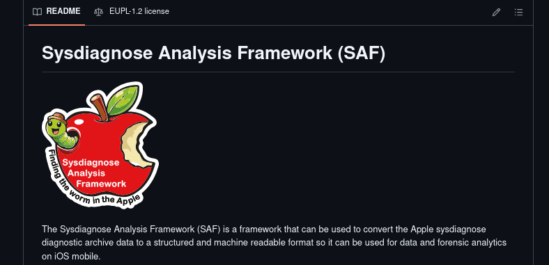

En regardant les strings trolldecrypt et signal dans `logarchive.jsonl` sorti par `SysdiagnoseAF` on tombe assez rapidement sur le chemin du nouveau `.ipa` généré via trolldecrypt.

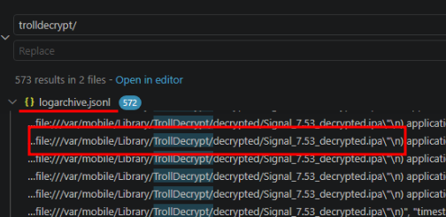

**Flag 2 :** `FCSC{com.fiore.trolldecrypt|/private/var/mobile/Library/TrollDecrypt/decrypted/Signal_7.53_decrypted.ipa|2025-04-07 07:40:47}`

### iC2

A ce niveau de l'investigation on a toutes les informations pour trouver le Framework de post exploitation et le serveur C2.

**Flag :** `FCSC{SeaShell|TCP|98.66.154.235|29552}`

### iCompromise

Désormais on cherche comment trolldecrypt a pu arriver sur le téléphone alors que le téléphone ne semble pas jailbreak.

En lisant le blog du début sur la structure des backups iTunes (*https://gist.github.com/leminlimez/c602c067349140fe979410ef69d39c28*) on se rend comtpe que c'est aussi un blog qui parle de l'exploit `Sparserestore`. C'est un exploit qui permet lors de la restauration d'un backup, d'écraser des fichiers systèmes en craftant une backup malveillante. Certains "[domaines](https://gist.github.com/leminlimez/c602c067349140fe979410ef69d39c28#what-is-a-domain)" iOS prennent un suffixe comme : `SysContainerDomain-[suffixe]`. Ce suffixe n'est pas vérifié et est vulnérable à une path travsersal.

En cherchant on tombe rapidement sur TrollRestore qui est un outil qui exploit cette vulnérabilité. L'article suivant donne beaucoups de détails sur l'exploit et TrollRestore : 
https://www.darkwirelabs.com/third.html.

> - TrollRestore: Exploiting CVE-2024-44252 in iOS
> - CVE-2024-44252 represents one such vulnerability, affecting the MobileBackup2 service in iOS.
> - TrollRestore is a tool that exploits this vulnerability to install TrollStore, a third-party app store that can run unsigned applications on iOS devices.
> - The service name com.apple.mobilebackup2 and is part of the iOS lockdown protocol

On cherche donc une tentative de backup antérieure et/ou des logs de lockdown qui viennent de `com.apple.mobilebackup2`. Toujours avec l'outil sysdiagnose on utilise le parser lockdown et on cherche des strings de mobilebackup2 dans `lockdown.json`: 

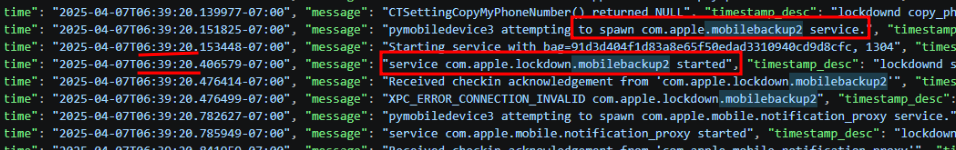
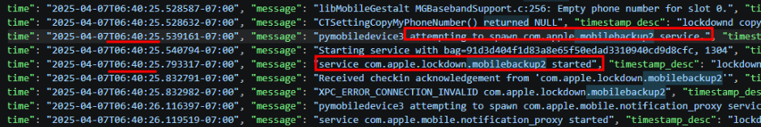

En regardant une nouvelle fois dans iLEAPP, la calculatrice apparait dans les applications intallées récemment. Calculatrice qui normalement est installée par défaut. On comprend que c'est l'application système qui a été modifiée.

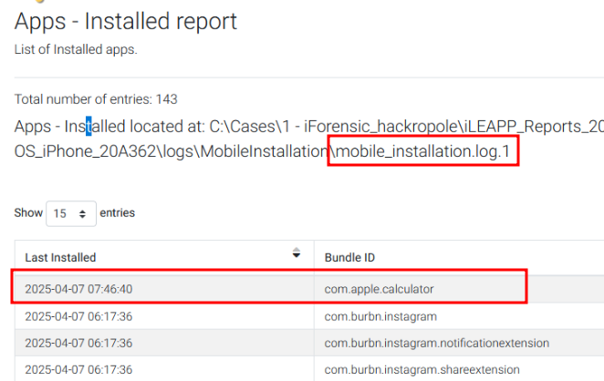

**Time code :**

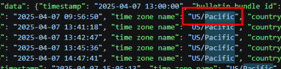

Les deux logs sur `mobilebackup2` sont à `06:39` et `06:40`. Dans les logs on trouve aussi que la time zone est en us/pacific donc `PST` -> `UTC` et ducoup ça donne `13:39` et `13:40`. On test les deux et on a le flag.

**Flag :** `FCSC{CVE-2024-44252|2025-04-07 13:40}`

---

## En résumé

- Les douaniers ont utilisé `TrollRestore` (qui exploite Sparserestore CVE-2024-44252) afin d'installer `TrollHelper` à la place d'une app système, ici c'était la calculatrice. 
- TrollHelper permet d'installer `TrollStore` sur le téléphone. TrollStore est une app jailée qui peut installer et "perma-signer" des fichiers IPA en exploitant la vulnérabilité CoreTrust d'Apple.
- Les douaniers ont ensuite installé `TrollDecrypt` sur le téléphone pour récupérer et déchiffrer signal : `/private/var/mobile/Library/TrollDecrypt/decrypted/Signal_7.53_decrypted.ipa`
- Ils récupèrent l'IPA déchiffrée afin d'implémenter une backdoor -> une lib créée par le framework de post-exploit ios `SeaShell`.
- Résultat : Signal backdooré, fonctionne normalement mais exécute du code malveillant en arrière-plan

> Merci à l'auteur du challenge \E, c'était vraiment très intéressant